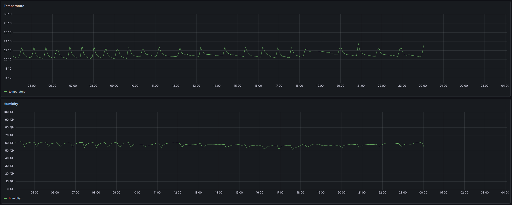

# SCADA/HMI Environment Monitoring System

A real-world SCADA system built on Raspberry Pi, MySQL, and Grafana — designed as a portfolio project for controls and automation engineering.

## Overview

This project demonstrates core SCADA/HMI concepts including distributed sensor nodes, a centralized historian database, operator controls, and an alarm management system.

## Hardware
In-Progress
<!-- ADD PHOTO: hardware_setup.jpg - Photo of Pi with AHT10 wired up -->

### Wiring
| AHT10 Pin | Raspberry Pi Pin |
|---|---|
| VCC | 3.3V (Pin 1) |
| GND | GND (Pin 6) |
| SDA | GPIO2 (Pin 3) |
| SCL | GPIO3 (Pin 5) |

<!-- ADD DIAGRAM: wiring_diagram.png - GPIO wiring diagram -->

## What is SCADA?

SCADA (Supervisory Control and Data Acquisition) is an industrial control system used to monitor and control equipment in industries like manufacturing, energy, and utilities. This project replicates those concepts on a small scale using a Raspberry Pi as a field device reporting to a central database and operator interface.

## Dashboard
Grafana


## HMI
In-Progress
<!-- ADD SCREENSHOT: hmi_screenshot.png - Operator controls interface -->

## System Architecture
```
[AHT10 Sensor] → [Raspberry Pi Node] → [SSH Tunnel] → [MySQL on VPS] → [Grafana Dashboard]
                                                              ↑
                                                        [HMI Interface]
                                                        - Start/Stop logging
                                                        - Adjust scan rate
                                                        - Set alarm thresholds
```

## Features

- Multi-node support — each Pi is independently identified by node ID and location
- Dynamic scan rate — adjustable from HMI without touching field devices
- Remote start/stop — operator can pause/resume logging from HMI
- Audit trail — all operator actions logged with username, old and new values
- Auto-restart — systemd service restarts the logger on reboot or crash
- Alarm management — email, Discord, and Kasa smart plug integration (coming soon)

## Tech Stack

| Component | Technology |
|---|---|
| Field Sensor | AHT10 Temperature & Humidity |
| Field Device | Raspberry Pi 4 Model B |
| Communication | SSH Tunnel / I2C |
| Database | MySQL on VPS |
| Visualization | Grafana |
| HMI | In development |
| Alerts | Email / Discord / Kasa (planned) |
| Language | Python 3 |

## Project Structure
```
scada-hmi/
├── pi/
│   ├── log_environment.py        # Main logging script
│   └── scada_config.template.ini # Config template (copy to scada_config.ini)
├── database/
│   └── schema.sql                # Full database schema
├── hmi/                          # HMI app (in development)
├── alerts/                       # Alert scripts (in development)
├── docs/                         # Wiring diagrams and documentation
└── README.md
```

## Hardware Setup

- Raspberry Pi 4 Model B
- AHT10 Temperature & Humidity Sensor
- Wiring: SDA → GPIO2, SCL → GPIO3, VCC → 3.3V, GND → GND

## Getting Started

### 1. Clone the repo
```bash
git clone https://github.com/YOURUSERNAME/scada-hmi.git
```

### 2. Set up the database
```bash
mysql -u root -p < database/schema.sql
```

### 3. Configure your node
```bash
cp pi/scada_config.template.ini pi/scada_config.ini
nano pi/scada_config.ini
```

### 4. Install dependencies
```bash
pip3 install adafruit-circuitpython-ahtx0 mysql-connector-python --break-system-packages
```

### 5. Run the logger
```bash
python3 pi/log_environment.py
```

### 6. Set up as a service
```bash
sudo cp pi/scada.service /etc/systemd/system/
sudo systemctl enable scada
sudo systemctl start scada
```

## Industry Concepts Demonstrated

- **Historian database** — time-series sensor data storage (similar to OSIsoft PI)
- **Distributed nodes** — multiple independent field devices reporting to one database
- **Operator HMI** — setpoints and controls without modifying field device code
- **Audit trail** — operator action logging for accountability and troubleshooting
- **Alarm management** — threshold-based alerts with multiple notification channels

## Author

Patrick Gannon
