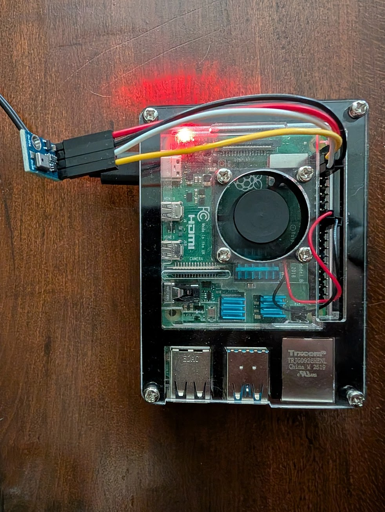
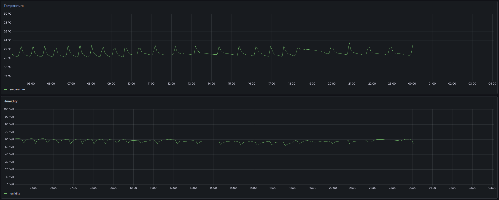

# SCADA/HMI Environment Monitoring System

A real-world SCADA system built on Raspberry Pi, MySQL, and Grafana — designed as a portfolio project for controls and automation engineering.

## Overview

This project demonstrates core SCADA/HMI concepts including distributed sensor nodes, a centralized historian database, operator controls, and an alarm management system.

## Hardware


### Wiring
| AHT10 Pin | Raspberry Pi Pin |
|---|---|
| VCC | 3.3V (Pin 1) |
| GND | GND (Pin 6) |
| SDA | GPIO2 (Pin 3) |
| SCL | GPIO3 (Pin 5) |

<!-- ADD DIAGRAM: wiring_diagram.png - GPIO wiring diagram -->

## What is SCADA?

SCADA (Supervisory Control and Data Acquisition) is an industrial control system used to monitor and control equipment in industries like manufacturing, energy, and utilities. This project replicates those concepts on a small scale using a Raspberry Pi as a field device reporting to a central database and operator interface.

## Dashboard
Grafana


## HMI

A web-based operator interface deployed at [utilities.blue/environment-monitor](https://utilities.blue/environment-monitor/)

<!-- ADD SCREENSHOT: hmi_screenshot.png - Operator controls interface -->

### HMI Features

- **Login authentication** — bcrypt passwords, PHP sessions, Secure/HttpOnly cookies
- **Role-based access** — Admin (full control) and Viewer (read-only) levels
- **Live data view** — real-time temperature and humidity per node, auto-refreshes every 5 seconds
- **Sparklines** — 1-hour trend graph per node, per measurement
- **Online/offline detection** — nodes marked offline if no reading within 1.5× scan interval
- **Operator controls** — start/stop logging, adjust scan rate, all changes reflect on field devices immediately
- **Automation system** — Create time-based schedules and sensor triggers for Kasa plugs with day-of-week selection, enable/disable triggers, action log with 1-hour cooldown between firings
- **Per-node thresholds** — set high/low limits for temperature and humidity per node or globally
- **Alarm historian** — all threshold breaches logged with 30-minute cooldown between alerts
- **Email alerts** — PHPMailer/Gmail SMTP notifications on threshold breach
- **Discord alerts** — webhook notifications (configure `DISCORD_WEBHOOK_URL` in `.env`)
- **Audit trail** — every operator action logged with username, old value, and new value
- **User management** — admins can create, disable, and change roles of operator accounts
- **Node display names** — human-readable aliases for node IDs, set from the HMI

## System Architecture

```
┌────────────────────────────────────────────────────────────────────────────────────┐
│                                    VPS / Cloud                                       │
│  ┌──────────────┐    ┌──────────────┐    ┌──────────────┐                          │
│  │   MySQL      │◄───┐│     HMI      │    │   Grafana    │                          │
│  │  Database    │    │  Interface   │    │ (3rd party)  │                          │
│  └──────────────┘    └──────────────┘    └──────────────┘                          │
│         ▲                                                                            │
└─────────┼────────────────────────────────────────────────────────────────────────────┘
          │ SSH tunnel (3306)
          │
┌─────────┴──────────┐
│   Raspberry Pi     │
│   (Single Device)  │
│                    │──I2C──▶┌──────────────┐
│                    │        │  AHT10       │
│                    │        │  Sensor      │
│                    │        └──────────────┘
│                    │
│                    │──SSH reverse──┐
│                    │   tunnel      │
│                    │   (8081)      ▼
│                    │        ┌──────────────┐
│                    │──LAN──▶│ Kasa Smart   │
│                    │        │   Plugs      │
└────────────────────┘        └──────────────┘
```

## Features

- Multi-node support — each Pi is independently identified by node ID and location
- Dynamic scan rate — adjustable from HMI without touching field devices
- Remote start/stop — operator can pause/resume logging from HMI
- Audit trail — all operator actions logged with username, old and new values
- Auto-restart — systemd service restarts the logger on reboot or crash
- Alarm management — email and Discord alerts on threshold breach
- **Automation tab** (admin only) — Manage time schedules (turn on/off at specific times on selected days) and sensor triggers (temperature/humidity thresholds)
- **Kasa smart plug integration** — Manual control, time-based schedules, and automated sensor triggers with action logging and cooldown protection

## Tech Stack

| Component | Technology |
|---|---|
| Field Sensor | AHT10 Temperature & Humidity |
| Field Device | Raspberry Pi 4 Model B |
| Communication | SSH Tunnel / I2C |
| Database | MySQL on VPS |
| Visualization | Grafana |
| HMI | PHP, PDO, PHPMailer — Apache on VPS |
| Smart Plugs | TP-Link Kasa (HS100/HS103/HS125) |
| Alerts | Email (Gmail SMTP) / Discord Webhook |
| Language | Python 3 (field) / PHP 8 (HMI) |

## Project Structure

```
scada-hmi/
├── pi/
│   ├── log_environment.py        # Main logging script
│   ├── local_controller_simple.py # Kasa plug local controller
│   ├── check_tunnel.sh           # Health check for SSH tunnels (run via cron)
│   ├── scada.service             # systemd service definition (SSH tunnels + logger)
│   ├── local_controller.service  # systemd service for Kasa plug controller
│   └── scada_config.template.ini # Config template (copy to scada_config.ini)
├── database/
│   └── schema.sql                # All database tables (core + HMI + plugs)
├── hmi/                          # Web-based operator interface
│   ├── index.php                 # Main dashboard with Automation tab
│   ├── cron/
│   │   └── check_schedules.php   # Time-based schedule executor (run via cron on VPS)
│   ├── login.php                 # Authentication
│   ├── api/
│   │   ├── auth.php              # Login / logout
│   │   ├── data.php              # GET endpoints (live, audit, alarms, thresholds, actions log)
│   │   └── control.php           # POST endpoints (settings, thresholds, users, Kasa triggers)
│   ├── includes/
│   │   ├── db.php                # PDO database connection
│   │   ├── auth.php              # Session management and role checks
│   │   ├── kasa_control.php      # Kasa plug controller class with trigger logic
│   │   └── alerts.php            # Threshold checker and alert dispatcher (cron)
│   ├── .env.template             # Environment variable template
│   ├── .htaccess                 # Directory protection
│   └── composer.json             # PHP dependencies (PHPMailer)
├── docs/                         # Wiring diagrams and documentation
└── README.md
```

## Getting Started

### Field Device (Raspberry Pi)

#### 1. Clone the repo
```bash
git clone https://github.com/patrick-gannon/scada-hmi.git
```

#### 2. Set up the database
```bash
mysql -u root -p < database/schema.sql
```

#### 3. Configure your node
```bash
cp pi/scada_config.template.ini pi/scada_config.ini
nano pi/scada_config.ini
```

#### 4. Install dependencies
```bash
pip3 install adafruit-circuitpython-ahtx0 mysql-connector-python python-kasa --break-system-packages
```

#### 5. Run the logger
```bash
python3 pi/log_environment.py
```

#### 6. Set up as a service
```bash
sudo cp pi/scada.service /etc/systemd/system/
sudo systemctl enable scada
sudo systemctl start scada
```

#### 7. Set up local controller for Kasa plugs
```bash
sudo cp pi/local_controller.service /etc/systemd/system/
sudo systemctl daemon-reload
sudo systemctl enable local_controller
sudo systemctl start local_controller
```

---

### Kasa Smart Plug Setup

#### 1. Install python-kasa (if not already installed)
```bash
pip3 install python-kasa --break-system-packages
```

#### 2. Discover your Kasa plugs
```bash
python3 -m kasa discover
```

#### 3. Configure plugs in the HMI
- Log in to the HMI as admin
- Go to the Controls tab
- Click "+ Add Smart Plug" 
- Enter plug details (ID, name, IP address, location)
- Create triggers:
  - **Manual triggers**: Control from HMI interface
  - **Time-based triggers**: Schedule on/off at specific times (e.g., 21:00 turn off)
  - **Sensor triggers**: Automated control based on temperature/humidity thresholds

#### 4. Configure Pi communication

**For local HMI (same network as Pi):**
Add to your HMI `.env` file:
```
PI_IP_ADDRESS=192.168.1.XXX
```

**For remote VPS (Pi behind NAT):**
Set up SSH reverse tunnel from Pi to VPS:
```bash
ssh -fN -R 8081:localhost:8081 user@your-vps-ip
```

Then add to VPS HMI `.env`:
```
PI_IP_ADDRESS=127.0.0.1
PI_PORT=8081
```

#### 5. Set up automation cron jobs
```bash
sudo crontab -e -u www-data
# Add for time-based schedule checking (every minute):
* * * * * /usr/bin/php /var/www/html/environment-monitor/includes/check_schedules.php >> /var/log/scada-schedules.log 2>&1

# Add for sensor trigger checking (every minute):
* * * * * /usr/bin/php /var/www/html/environment-monitor/includes/alerts.php >> /var/log/scada-alerts.log 2>&1
```

#### 6. Set up tunnel health monitoring (recommended)
The `check_tunnel.sh` script monitors both MySQL (3306) and controller (8081) tunnels:
```bash
# Copy the script to your Pi
cp pi/check_tunnel.sh ~/scada-hmi/pi/
chmod +x ~/scada-hmi/pi/check_tunnel.sh

# Add to crontab on Pi (runs every 2 minutes)
crontab -e
*/2 * * * * /home/patrick/scada-hmi/pi/check_tunnel.sh
```

#### 7. Supported plug models
- TP-Link Kasa HS100, HS103, HS125, and other Kasa smart plugs
- Plugs must be on the same network as the Raspberry Pi
- No cloud account required - uses local network control

---

### HMI (VPS / Web Server)

Requires: PHP 8.0+, extensions `pdo_mysql`, `curl`, `json`, Apache with `mod_alias` and `mod_rewrite`.

#### 1. Deploy files
```bash
sudo mkdir -p /var/www/html/environment-monitor
sudo cp -r hmi/* /var/www/html/environment-monitor/
sudo chown -R www-data:www-data /var/www/html/environment-monitor/
```

#### 2. Install PHP dependencies
```bash
cd /var/www/html/environment-monitor
composer install
```

#### 3. Configure environment
```bash
cp .env.template .env
nano .env        # fill in DB credentials, SMTP, Discord webhook
chmod 640 .env
chown www-data:www-data .env
```

#### 4. Set up database tables
```bash
mysql -u your_db_user -p scada < database/schema.sql
```

This single schema file includes all tables: core SCADA (environment, settings), HMI (users, nodes, thresholds), and Kasa plugs (plugs, triggers, actions_log).

#### 5. Configure Apache
Add to your SSL VirtualHost:
```apache
Alias /environment-monitor /var/www/html/environment-monitor

<Directory /var/www/html/environment-monitor>
    Options -Indexes -FollowSymLinks
    AllowOverride All
    Require all granted
    DirectoryIndex index.php
</Directory>

<Directory /var/www/html/environment-monitor/includes>
    Require all denied
</Directory>
```

#### 6. Set up alert cron job
```bash
sudo crontab -e -u www-data
# Add:
* * * * * /usr/bin/php /var/www/html/environment-monitor/includes/alerts.php >> /var/log/scada-alerts.log 2>&1
```

#### 7. Default login
```
Username: admin
Password: password  ← change immediately after first login
```

---

## Industry Concepts Demonstrated

| This Project | Industry Equivalent |
|---|---|
| AHT10 on Pi | Field sensor / RTU |
| MySQL on VPS | Historian database (OSIsoft PI) |
| Grafana | SCADA trending screen |
| HMI with setpoints | Operator workstation |
| Email / Discord alerts | Alarm management system |
| Kasa plug control | PLC output / actuator |
| Audit log | Regulatory compliance logging |
| Multi-node support | Distributed control system |
| Role-based access | Operator vs engineer access levels |
| Automated triggers | Control loops and interlocks |

## Author

Patrick Gannon
